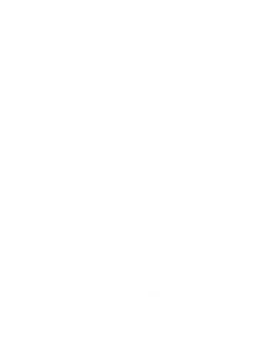

# Green Bank

Projet proposé lors de l'Asynconf 2023 par le partenaire Banque Populaire.

Pour tester le projet en ligne le lien : https://asynconf2023.dowedev.fr

## Contexte proposé

La Green Bank, fondée en 2022, est une institution financière novatrice axée
sur la durabilité et l'impact environnemental positif. Son objectif principal est
de catalyser des investissements et des initiatives qui favorisent la transition
vers une économie verte et durable.
Répondant à la nécessité croissante de mesurer et de comprendre l'impact
environnemental des activités humaines, la Green Bank souhaite lancer un
outil de calcul de l'empreinte écologique.

Cet outil interactif permet aux individus de quantifier leur impact sur
l'environnement en termes de consommation d'énergie, d'émissions de gaz à
effet de serre et d'utilisation des ressources naturelles.

## Prérequis

Composer ^2.5

node ^8.15.0

npm ^v16

PHP ^8.1 

## Installation

1. Dans un premier temps vous pouvez clôner ce dépôt :
``git clone https://github.com/B45T13N/green_bank``
2. Ensuite installer les dépendances nécessaires :
``composer install && npm install``
3. Modifier le fichier .env afin qu'il correspond à votre environnement
4. Lancer les commandes de migrations de base de données : ``php artisan migrate``
5. Lancer la commande de seed : ``php artisan db:seed``
6. Lancer le serveur avec ``npm run dev``
7. Des tests sont implémentés pour la partie back-end `php artisan test`

## Remerciements
Merci à l'asynconf ainsi qu'à la Banque Populaire pour ce challenge qui était 
intéressant à implémenter.

Merci également à tous les partenaires pour cette conférence qui 
était une nouvelle fois très intéressante.

